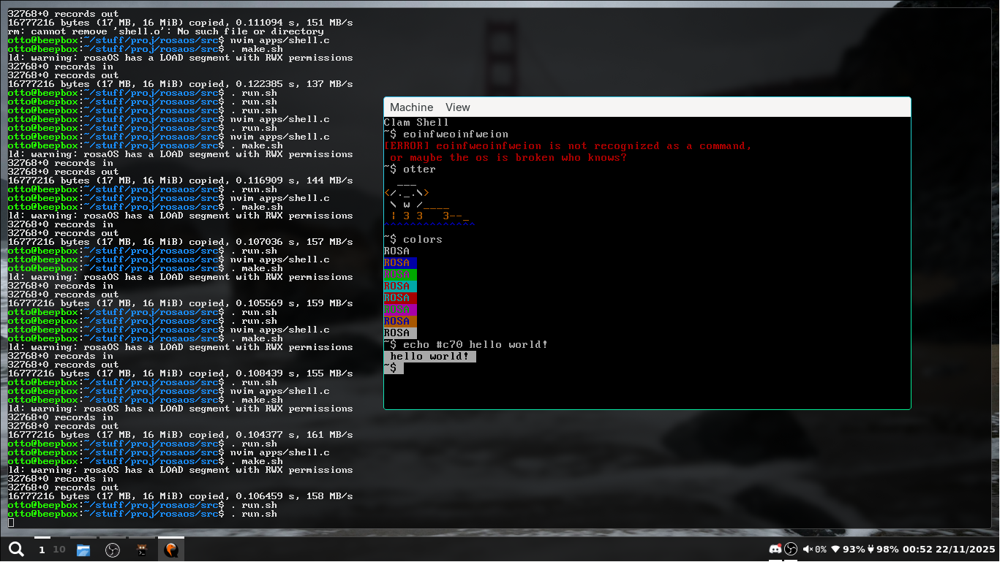

# rosaOS
dedicated to rosa the otter
(basically a joke os at this point, yall can fork and fix if you want)

# Dependencies:
- nasm
- gcc
- qemu
- (and) lib32-glibc
# Usage:
- open terminal
- navigate to the rosaOS directory (here)
- `. run.sh`
- if any errors occur, submit a descriptive (or not who cares) issue on github.
